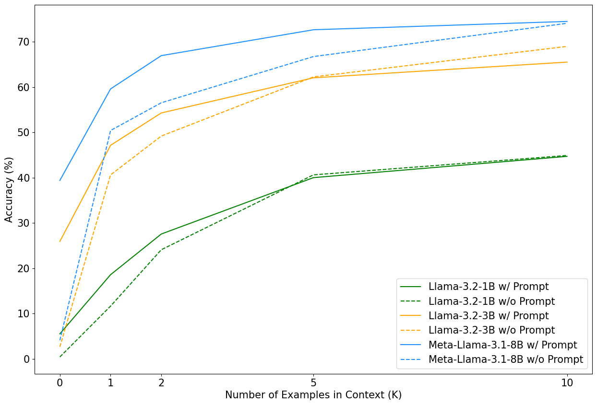

# Evaluating the In-Context Learning Capabilities of Language Models

This repository provides code to evaluate LLM in-context learning performance on the **symbol removal task** from the [GPT-3 paper](https://arxiv.org/abs/2005.14165) (Figure 1.2), where the model is tasked with removing random symbols from corrupted words. This is a simple task designed to study in-context learning (ICL) capabilities of language models across different scales. 

### Results on the Llama 1B, 3B, 8B Base Models 

Using this repository, I recreated Figure 1.2 from the GPT-3 paper with the [Llama 3.2 1B](https://huggingface.co/meta-llama/Llama-3.2-1B), [Llama 3.2 3B](https://huggingface.co/meta-llama/Llama-3.2-3B), and [Llama 3.1 8B](https://huggingface.co/meta-llama/Llama-3.1-8B) models. The experiments were run on a single Nvidia A40 GPU on the [Vector Insitute](https://vectorinstitute.ai/) compute cluster. 



## Symbol Removal Task 

In the symbol removal task, the model is asked to remove random symbols (e.g., @, #, $) from corrupted words given `K` labeled examples and (optionally) a task description in the context. For example,

Input Prompt:
```
Identify the corrupted word in the list by removing all symbols:

Input: d?r?o#n#e
Output: drone

Input: @t#ech%n!i-c^i@a^n
Output: technician

Input: ^el+e*ph$a@n%t
Output: elephant

Input: y*a^r#n
Output:
```

In this prompt, the model is asked to remove symbols from the input, `y*a^r#n`, to predict the target word, `yarn`. The model is given a task description and 3 labeled example in the context. 

## Setup

### Clone the Repository
```
git clone https://github.com/jbxnes/llama-icl.git
cd llama-icl
```

### Install Dependencies
To use this repository, install the conda environment on a Linux machine with Nvidia GPU. Make sure the GPU you are using is sufficient to run `fp16` inference on your models of interest. 
```
conda create -n icl python=3.10
conda activate icl
pip install -r requirements.txt
```

### Download the Models 
Ensure you have access to the models you want to evaluate via HugginFace. Make sure `root_dir` points to the directory with all the model weights (see [Usage](##Usage)). It is important that that model weights are compatible with the HuggingFace API. 

## Usage 

Running the evaluation script:
```
python run.py \
    --models Llama-3.2-1B-Instruct Llama-3.2-3B-Instruct Meta-Llama-3.1-8B-Instruct \
    --root_dir ./ \
    --corruption_rate 0.7 \
    --run_id 123
```
The results will be saved to a new folder `./results`.

### Arguements
* `models`: A list of model names that you want to evaluate.
* `root_dir`: The root directory for the model weights.
* `corruption_rate`: The probability of inserting a symbol for the symbol removal task.
* `run_id`: A unique identifier for the run.

### Evaluation Details

The script `run.py` runs the same evaluation scheme for each model in the list. We evaluate each model on 300 unique words (see `words.py`) on varying amounts of context `K = 0, 1, 2, 5, 10`. Additionally, we evaluate the models at each of these context sizes with and without a task description within the prompt. 

### Saved results

The results are saved to JSON files, e.g., [./results/llama-base_results_prompt=True.json](/results/llama-base_results_prompt=True.json). Below is a simplified results file to demonstrate the structure.
```
{
    "Llama-3.2-1B": {
        "accuracies": [
            0.0
        ]
        "predictions": {
            "0": [
                {
                    "input_word": "#ap?p+le",
                    "target_word": "apple",
                    "prediction": "#ap?p+le\nInput: #ap?p+",
                    "correct": false,
                    "prompt": "Input: #ap?p+le\nOutput:"
                },
            ]
        }
    }
}
```